## Documentación de MongoDB

Documentación de MongoDB, pymongo (cliente para python) y MongoEngine (Object-Document Mapper for Python).

Creada a partir de las transparencias de la asignatura **Gestión de la Información en la Web** de la **Universidad Complutense de Madrid**.

[TOC]


## 1. Instalación

```shell
#Repositorios
sudo apt install mongodb #En Debian, Ubuntu y derviados

#Binarios
#Linux 64bits
wget https://fastdl.mongodb.org/linux/mongodb-linux-x86_64-ubuntu1604-3.4.0.tgz
#MacOS with SSL
wget https://fastdl.mongodb.org/osx/mongodb-osx-ssl-x86_64-3.4.0.tgz

#Descomprimir los binarios y utilizarlos directamente
```

## 2. Servidor

```Shell
#Inicia el servidor con la BD en la ruta dada
$ mongod --dbpath /home/users/mongo
#Para importar un json con datos
$ mongoimport --db nombreDB --collection col --drop --file dataset.json
```

## 3. Cliente

```Shell
#Una vez iniciado el servidor se inicia la consola del cliente con:
$ mongo
#Algunos comandos útiles
> use pruebas #Usa la BD dada
> show dbs #Muestra las BDs
> show collections #Muestra las colecciones en una BD
```

### 3.1. Inserción

- Se usa la función **insert**
- Los **nombres de campo** son siempre **cadenas de texto**. Si no se incluyen mongo añadirá las comillas automáticamente a los nombres de campo. Por lo tanto:

  ​{name:"Pepe", nhijos:3}

  ​	será transformado a

  ​{"name":"Pepe", "nhijos":3}

- **Todo documento** insertado en MongoDB tiene **campo identificador** llamado **_id**

  Este **_id** es **único** en cada colección y sirve para buscar rápidamenteun documento (mediante un índice)

  Si un documento insertado no incluye el identificador **_id** entonces MongoDB lo añadirá automáticamente:

```javascript
> db.users.insert({name:"Pepe", nhijos:3})
> db.users.insert({name:"Juan", web:"www.juan.com"})
//A partir de Mongo 3.2
> db.users.insertOne()
> db.users.insertMany()
```

Ver más detalles en las **[Referencias (Operaciones CRUD)](#11. Referencias)**

### 3.2. Modificación

- Se usa la función **update**

- Reemplaza el documento con campo **name=Ana** por **{name:"oculto"}**

  ```javascript
  > db.users.update({name:"Ana"},{name:"oculto"})
  //A partir de MongoDB 3.2
  > db.users.updateOne()
  > db.users.updateMany()
  > db.users.replaceOne()
  ```

- Por defecto, si existen varios documentos que encajen solo se modificará uno.

- Para **añadir un campo nuevo o reemplazar** el valor de un campo existente en un documento se utiliza la función **update** con el modificador **$set**:

  ```javascript
  //Añade al documento con name=Juan el campo sexo=varon
  > db.users.update({name:"Juan"}, {"$set":{sexo:"varon"}})
  ```

- También se pueden **eliminar campos** utilizando la función **update** junto con el modificador **$unset**

- Elimina el campo sexo del documento con campo name=Juan:

  ```javascript
  > db.users.update({name:"Juan"}, {"$unset":{sexo:1}})
  //No importa el valor que se ponga para el campo sexo, en este caso es un 1 pero podía ser “”, true, etc.
  ```


Ver más detalles en las **[Referencias (Operaciones CRUD)](#11. Referencias)**

### 3.3. Eliminación

- Se usa la función **remove**

- Por defecto **remove** elimina todos los **docuemntos** que encajan, aunque se puede modificar con el parámetro **justOne**

  ```javascript
  > db.users.remove({name:"Pepe"})
  //A partir de MongoDB 3.2
  > db.users.deleteOne()
  > db.users.deleteMany()
  ```


Ver más detalles en las **[Referencias (Operaciones CRUD)](#11. Referencias)**

### 3.4. Consultas

- Se usa la función **find**

  ```javascript
  > db.users.find() //Devuelve todos los documentos
  > db.users.find({name:"Ana"}) //Devuelve docs con el campo name=”Ana”
  > db.users.find({$or: [{name:"Ana"},{nhijos:3}]}) //name=Ana o nhijos=3
  ```

- **Comparaciones:**

  |  Valor   | Función |
  | :------: | :-----: |
  | **$eq**  |   ==    |
  | **$gt**  |    >    |
  | **$gte** |   >=    |
  | **$lt**  |    <    |
  | **$lte** |   <=    |
  | **$ne**  |   !=    |

- **Lógicas:** 

  - **$or**
  - **$and**
  - **$not**
  - **$nor**

- **Elemento:**

  - **$exists** → Existencia de un campo
  - **$type** → Un campo contiene un valor de un tipo determinado

#### 3.4.1. Consultas en listas

- Se puede buscar por valores en una lista. Ej:documentos que contienen “musica” en el campo gustos (en alguna posición)

  ```javascript
  > db.users.find({gustos: "musica"})
  { "_id":*, "name":"Ana", "gustos":[ "musica", "p2p" ] }
  ```

- También se puede buscar aquellos documentos que tengan ciertos elementos en un campo lista usando el modificador **$all**. Ej: documentos cuyo campo gustos contengan “p2p” y “musica” (no importa el orden)

  ```javascript
  > db.users.find({gustos: {$all: ["p2p", "musica"]}})
  { "_id":*, "name":"Ana", "gustos":["musica", "p2p"] }
  ```

#### 3.4.2. Consultas en campos anidados

- Para acceder a campos internos de los documentos se utiliza la notación **campo1.campo2**:

  ```javascript
  > db.users.insert({name:"Lola",dir:{calle:"Mayor",num:2} })
  > db.users.find({"dir.calle": "Mayor"}
  {"_id":*, name:"Lola",dir:{calle:"Mayor",num:2}
  > db.users.find({"dir.num": 2})
  {"_id":*, name:"Lola",dir:{calle:"Mayor",num:2}
  ```

- La misma notación se utiliza para acceder a los elementos de un array: **campo.N**

  ```javascript
  > db.users.insert({name:"Ivan", ejemplares:[1,2,5]}) > db.users.find({"ejemplares.2":5})
  {"_id":*, "name":"Ivan", "ejemplares":[1,2,5] }
  ```

#### 3.4.3. Consultas where

- Como hemos visto en los ejemplos, los valores usados en la consulta deben ser **constantes**. Por tanto no se pueden referir a **otro campo del documento**.

- La cláusula where nos permite incluir un predicado JavaScript que evalúa la condición de búsqueda; Ejemplo: Si buscamos los usuarios con los dos apellidos iguales:

  ```javascript
  > db.users.find( {"$where" : function () {
  if ('apellido1' in this && 'apellido2' in this)
  // Si existen los campos en el documento
  return this['apellido1'] == this['apellido2']; else
        return false;
    }
  })
  ```

- Las consultas where requieren recorrer la colección completa → **ineficientes**, no se puede aprovechar ningún **índice**.

#### 3.4.4. Proyección de resultados

- Se puede **proyectar** qué campos de los documentos se **devolverán** en una consulta.

- Para ello se usa el segundo parámetro de lafunción find():

  ```Javascript
  > db.users.find({nhijos: {$gt:2}}, {name:1,_id:0})
  ```

- Pondremos a **0** los campos que queremos ocultar y a **1** los campos que queremos visualizar.

  - En el ejemplo ocultamos `_id` y mostramos únicamente `name`. 

#### 3.4.5. Limitar resultados

- Se puede limitar el número de resultados a mostrar mediante el modificador **limit**.

  Ej: mostrar solo los 2 primeros documentos de la colección **users**:

  ```Javascript
  > db.users.find().limit(2)
  ```

- También se pueden omitir los primeros documentos devueltos por la consulta mediante **skip**.

  Ej: mostrar los documentos de users salvo los 2 primeros:

  ```javascript
  > db.users.find().skip(2)
  ```

- **limit()** y **skip()** se pueden usar para paginar los resultados, aunque es mejor no usar **skip** en colecciones grandes (en esos casos mejor usar condiciones de búsqueda: 

  `fecha >= ultima_fecha, precio >= ultimo_precio, etc.)`

#### 3.4.6. Ordenar resultados

- Por defecto, los documentos se muestran en el **orden** en que están almacenados en **disco**.

- Para ordenar los resultados obtenidos se utiliza el modificador **sort**. Este modificador acepta una serie de campos por los que ordenar:

  ```Javascript
  > db.users.find().sort({name:-1, nhijos:1})
  ```

  - **name:-1** → ordenación **descendente** por **name**
  - **nhijos:1** → ordenación **ascendente** por **nhijos**
  - Primero ordenar por **name**, y para los empates utiliza **nhijos** (orden **lexicográfico**).

Ver más detalles en las **[Referencias (Operaciones CRUD)](#11. Referencias)**

## 4. Pymongo (mongo desde Python)

- Para conectar, modifica y consultar bases de datos MongoDB desde Python utilizaremos el módulo **pymongo**.


- Hay distintas clases, entre las que destacan:
  - MongoClient
  - Database
  - Collection
  - Cursor
- En la página principal de pymongo podéis encontrar instrucciones de instalación, tutoriales, ejemplos, etc.: https://api.mongodb.com/python/current/
- También contiene toda la documentación API: https://api.mongodb.com/python/current/api/index.html

### 4.1. MongoClient

- La clase MongoClient nos permite conectar con un servidor MongoDB, por defecto se conecta a `localhost:27017` pero se pueden pasar por parámetros:

  - Host y puerto
  - Timeouts de la conexión
  - Certificados SSL para autenticar y cifrar la conexión

  ```python
  from pymongo import MongoClient
  mongoclient = MongoClient()
  ```

- Dado un objeto MongoClient, podemos acceder a una base de datos concreta mediante:

  - Atributo → db = `mongoclient.giw`
  - Corchetes → db = `mongoclient['giw']`

  Ambos métodos devuelven un objeto de la clase **Database**

- MongoClient también se usa para obtener el **listado** de bases de datos y para **borrarlas**.

  ### 4.2. Database

- Un objeto Database nos permite acceder a sus colecciones de una manera similar a MongoClient:

  - Atributo → c = `db.users`
  - Corchetes → c = `db['users']`

  Ambos métodos devuelven un objeto de la clase **Collection**

- Database también permite consultar las colecciones existentes o eliminar colecciones.

### 4.3. Collection

- Es la clase principal sobre la que serealizarán las operaciones CRUD:
  - **Create**: insert_one, insert_many
  - **Read**: find, find_one
  - **Update**: replace_one, update_one, update_many, update
  - **Delete**: delete_one, remove
- Aparte de éstos también existen otras operaciones CRUD, ver más información en las **[Referencias](#11. Referencias)**.

### 4.4. Documentos en pymongo

-  Un aspecto muy cómodo de pymongo es que los **documentos JSON** necesarios en las operaciones se representan con **diccionarios**.

-  Los diccionarios Python y los documentos JSON tienen la **misma sintaxis**:

   ```python
           doc = {'name':'pepe', 'edad':24}
           # doc es un diccionario Python
           collection.insert_one(doc)
   ```

### 4.5. Valores de retorno

- Las **operaciones** CRUD **devuelven** distintos tipos de objeto resultado:
  - InsertOneResult
  - InsertManyResult
  - UpdateManyResult
  - UpdateResult
  - DeleteResult
  - Cursor
- Hay que consultar estos objetos para conocer el resultado de las operaciones.

### 4.6. Cursor

- Las consultas de colecciones (**find**) devuelven un objeto **Cursor**.

- Este objeto permite acceder a los **resultados**:

  - **Recorrer** → `for e in cursor`
  - **Acceder a un elemento** → `cursor[50]`
  - **Acceder a una parte** → `cursor[10:20]`

- El objeto Cursor también permite condicionar la consulta:

  - count
  - limit
  - skip
  - sort
  - where

  Ver más detalles en las **[Referencias (Cursor)](#11. Referencias)**

### 4.7. Ejemplo

```Python
from pymongo import MongoClient

mongoclient = MongoClient()
db = mongoclient['giw']
c = db['test']

ana = {'name':'ana', '_id':0, 'edad':23}
res = c.insert_one(ana)
print(res.inserted_id)

doc = c.find_one({'_id':0})
print(doc)

res = c.delete_one({'_id':0})
print(res.deleted_count)
```

## 5. Esquema de la Base de Datos

- MongoDB **carece** de **esquema estricto**, esto tiene las **ventajas** de poder añadir datos que tienen una estructura diferente (**adaptabilidad**) y un **inicio rápido** para utilizar la BD, pero tiene las **desventajas** de **falta de garantías** sobre los datos almacenados y **sobrecarga** que hace trabajar más al programador.

- Para suplir las desventajas se usa un **esquema implícito** que **especifica** los **contenidos** de un documento. Para cada uno de ellos determina:

  - Su identificador
  - Si es obligatorio o si es opcional
  - El tipo de datos que contiene
  - Si almacena documentos **anidados**, también será establecer su esquema implícito.

  En python se usa **[MongoEngine](#6. MongoEngine)** como capa intermedia entre MongoDB y el programa.

```shell
DOC_USUARIO
{ “_id”:       integer (obligatorio),
  “nombre”:    string (obligatorio),
  “apellidos”: string (opcional),
  “pais”:      string (opcional)
  “vip”:       bool (opcional)
  “dir” :      DOC_DIR (opcional)
}

DOC_DIR
{ “tipo_via”:   string (obligatorio)
  “nombre_via”: string (obligatorio),
  “number”:     integer (opcional),
  “cod_postal”: integer (opcional)
}
```


## 6. MongoEngine

- MongoEngine es una **capa intermedia** entre el programa Python y MongoDB para conseguir:
  - Seguir disfrutando del esquema flexible de MongoDB.
  - Garantizar un mínimo de coherencia.
- Para ello, MongoEngine realiza una **transformación objeto-documento** (Object-Document Mapping, ODM) entre objetos Python y los documentos de las colecciones MongoDB.
- Con MongoEngine definimos clases Python junto con su esquema: campos esperados y tipos de datos.
- MongoEngine **traduce** los objetos a documentos MongoDB **garantizando** que cumplen el esquema definido.
- MongoDB **almacena** los documentos como siempre, ignorando completamente el esquema definido en MongoEngine.
- MongoEngine proporciona métodos para realizar consultas a Mongo y recuperar directamente los objetos Python de manera sencilla.

### 6.1. Conexión

- Para conectar con el servidor **mongod** se usa **connect()**, por defecto se conecta a **localhost** en el puerto **27017**

  ```python
  from mongoengine import connect
  connect('nombre_bd')
  #Con más parámetros:
  connect(
    name='db',
    username='user',
    password='12345',
    host='92.168.1.35'
  )
  ```

### 6.2. Definición del esquema

- Para definir el ODM declararemos **clases Python** que **heredan** de clases de MongoEngine (**Document, DynamicDocument o EmbeddedDocument**)

- Dentro de cada clase declararemos los **campos** que existen, su **tipo** y otra **información** (si es clave primaria, es obligatorio, etc.)

- **Ejemplo**: Definir una clase **Asignatura** con 3 campos:

  - **nombre**: cadena de texto, obligatorio
  - **código**: entero, clave primaria → obligatorio
  - **temario**: lista de cadenas de texto, no obligatorio

  ```python
  class Asignatura(Document):
      nombre = StringField(required=True)
      codigo = IntField(primary_key=True)
      temario = ListField(StringField())
  ```

#### 6.2.1. Document

- Las clases que heredan de **Document** almacenan los objetos de ese tipo en una **colección** con el mismo nombre que la clase (en minúsculas).

- Si se añaden **campos adicionales** no declarados a un objeto, éstos **no se almacenarán** en la base de datos. Por lo tanto, **Document** es interesante para objetos cuya composición se conoce perfectamente y no se esperan cambios en el futuro.

- Definición:

  ```python
  class Asignatura(Document):
  	nombre = StringField(required=True)
  	codigo = IntField(primary_key=True)
  	temario = ListField(StringField())
  ```

- Creación y almacenamiento:

  ```python
  a = Asignatura([nombre="GIW",
                 codigo=803348,
                 temario=["XML y JSON", ...]])
  a.profesor = "Enrique" # Campo adicional
  a.save()
  ```

- El documento almacenado en la colección **asignatura** no contendrá el campo **profesor**, ya que no aparecía en el esquema de **Asignatura**:

  ```python
  {
     "_id" : 803348,
     "nombre" : "GIW",
     "temario" : [ "XML y JSON", ...]
  }
  ```

#### 6.2.2. DynamicDocument

- Las clases que heredan de **DynamicDocument** almacenan los objetos de ese tipo en una **colección** con el mismo nombre que la clase (en minúsculas), al igual que Document.

- Como diferencia, los **campos adicionales** añadidos a un objeto sí **se almacenarán** aunque no hayan sido definidos en el esquema. Por lo que **DynamicDocument** es interesante en objetos para los que conocemos su composición básica pero que son susceptibles de ser **ampliados** en el futuro.

- Definición:

  ```python
  class Asignatura(DynamicDocument):
  	nombre = StringField(required=True)
      codigo = IntField(primary_key=True)
      temario = ListField(StringField())
  ```

- Creación y almacenamiento:

  ```python
  a = Asignatura([nombre="GIW",
                 codigo=803348,
                 temario=["XML y JSON", ...]])
  a.profesor = "Enrique" # Campo adicional
  a.save()
  ```

- El documento almacenado en la colección **asignatura** **sí** contendrá el campo **profesor**, aunque no aparecía en el esquema de **Asignatura**:

  ```python
  {
  	"_id" : 803348,
  	"nombre" : "GIW",
  	"temario" : [ "XML y JSON", ...],
      "profesor" : "Enrique"
  }
  ```

#### 6.2.3. Campos

- Por defecto los **campos** almacenados en MongoDB tienen el **mismo nombre** que los atributos definidos en MongoEngine.

- Este comportamiento se puede cambiar con el parámetro **db_field** en cada campo:

  ```python
  class Asignatura(Document):
      nombre = StringField(db_field='name')
      ...	
  ```

- Los campos también aceptan otros parámetros:

  - **required**: el campo es obligatorio (por defecto False).
  - **default**: valor por defecto que tomará el campo si nose asigna. Puede ser un `callable` (p. ej. una funciónsin argumentos) que calcula el valor por defecto.
  - **unique**: el campo es único (por defecto False).
  - **unique_with**: para definir combinaciones de campos como valores únicos (por defecto None).
  - **primary_key**: el campo es la clave primaria _id.

- También se puede limitar a que un campo contenga **valores** de un **listado fijo**.

- Para ello se usa el parámetro **choices**, que acepta una lista de valores legítimos:

  ```python
  class Persona(Document):
      sexo = StringField(choices=['H','M'])
      ...
  ```

- Si el campo toma un valor no especificado en **choices**, la validación fallará (lanzará una excepción **ValidationError**)  y el objeto no se almacenará en MongoDB.

- MongoEngine permite utilizar **muchos** tipos de campos diferentes. Veremos solo unos pocos (más información en las **[Referencias](#11. Referencias)**):

  - **BooleanField**:

    - Define un campo que solo puede contener un valor booleano: True o False.

      ```python
      class Persona(Document):
          parado = BooleanField
      	...
      ```

    - Tened **cuidado** porque Python puede evaluar casicualquier expresión a un booleano, por lo que habrá validaciones que sorprendentemente tendrán éxito:

      `p = Persona(parado=”SI”,...)` Establecerá **parado** a **True** porque **bool(“SI”) → True**

  - **IntField, LongField, FloatField**:

    - **IntField** y **LongField** definen campos para números **enteros** de **32 y 64 bits** respectivamente.

    - **FloatField** define un campo para números en **coma flotante**.

    - Los 3 campos permiten acotar los valores:

      - **min_value**: valor mínimo
      - **max_value**: valor máximo

    - Almacenar la edad de una Persona en años, supeso en kilogramos y el número de pasos queha dado en toda su vida:

      ```python
      class Persona(Document):
          edad = IntField(min_value=0,
                        max_value = 200)
      	peso = FloatField(min_value=0)
          pasos = LongField(min_value=0)
          ...
      ```

  - **StringField**

    - Define un campo que contiene una **cadena de texto**.

    - Acepta varios parámetros para especificar los valores válidos:

      - **min_length**: longitud mínima.
      - **max_length**: longitud máxima.
      - **regex**: expresión regular que debe cumplir sucontenido.

    - Para almacenar el NIF de una persona, añadiríamos un campo tipo cadena:

      ```Python
      Class Persona(Document):
          nif = StringField(
              max_length = 9,
              regex = "[0-9]+[A-Z]")
      	...
      ```

  - **ComplexDateTimeField**

    - Define un campo para contener una **fecha** con **precisión** de microsegundo: `'YYYY,MM,DD,HH,MM,SS,NNNNNN'` Ej: '1900,01,01,15,38,52,138464'
    - En MongoDB se almacenan como **cadenas** de texto.
    - Estos campos se pueden **comparar** con >, <,  >=, etc. ya que son cadenas de texto, y el orden **lexicográfico** funciona adecuadamente.

  - **ListField**

    - Define una lista de valores, todos del tipo de datos especificado y cumpliendo las restricciones impuestas.
    - Lista de booleanos: `ListField( BooleanField )`
    - Lista de cadenas de al menos 3 caracteres: `ListField( StringField( min_length=3 ) )`
    - Lista de enteros entre 0 y 100: `ListField( IntField (min_value=0, max_value=100 ) )`

  - **EmailField, URLField**

    - **EmailField** permite definir campos de texto que deben contener un e-mail bien formado.

    - **URLField** define campos de texto con un URL bien formado. Adicionalmente puede verificar que el recurso existe con el parámetro **verify_exists**.

      ```python
      class Persona(Document):
      	email = EmailField
      	web = URLField(verify_exists = True)
          ...
      ```

#### 6.2.4. Anidar y referenciar

- En MongoDB hay dos técnicas para **relacionar** documentos:

  - **Anidar** uno dentro de otro.
  - **Referenciar** uno desde otro usando su **_id**.

- MongoEngine nos va a permitir definir este tipo de relaciones usando campos de tipo:

  - **EmbeddedDocumentField**
  - **ReferenceField**

- **Anidar:**

  - Para anidar una clase como campo interno otra, la clase anidada debe heredar de **EmbeddedDocument** o **DynamicEmbeddedDocument**.

  - Estas clases **no generarán una colección** dedicada para almacenar objetos, ya que estarán anidadas dentro de otras.

  - Los **campos adicionales** no declarados en una clase se **almacenarán** en MongoDB si se hereda de **DynamicEmbeddedDocument**.

  - Si se hereda de **EmbeddedDocument** los campos adicionales se **ignorarán** al volcar a MongoDB.

  - Para definir un campo con un objeto anidado, usaremos el tipo **EmbeddedDocumentField**:

    ```python
    class Direccion(EmbeddedDocument):
    calle = StringField(required=True)
    numero = IntField(min_value=0)

    class Persona(Document):
        dir=EmbeddedDocumentField(Direccion)
        ...
    ```

- **Referenciar:**

  - Al referenciar, incluimos el **identificador** de un documento de una **colección externa** en uno de los campos del documento.

  - Para incluir referencias en MongoEngine usaremos campos **ReferenceField**:

    ```		python
    class Mascota(Document):
    	nombre = StringField

    class Persona(Document):
    	mascota = ReferenceField(Mascota) #Otra clase
    	jefe = ReferenceField("self") #Misma clase
    ```

  - Cuando un objeto tiene un campo referenciado, debemos elegir **qué hacer** cuando el objeto referenciado se **elimina** de lacolección externa.

  - Para ello usamos el parámetro **reverse_delete_rule** del campo **ReferenceField**:

    - **DO_NOTHING (0)**: no hacer nada (por defecto).
    - **NULLIFY (1)**: elimina el campo que contiene la referencia.
    - **CASCADE (2)**: elimina los documentos que contienen la referencia.
    - **DENY (3)**: impide borrar documentos de la colección externa si están referenciados.
    - **PULL (4)**: si el campo donde está la referencia es un ListField, elimina dicha referencia de la lista.

### 6.3. Manipulación de objetos

- Esquema de ejemplo:

  - **Direccion** está **anidado** dentro de **Persona**.

  - **Mascota** está **referenciado** desde **Persona**.

    ```				python
    class Direccion(EmbeddedDocument):
        calle = StringField(required=True)
        numero = IntField(min_value=0)

    class Mascota(Document):
    	nombre = StringField(required=True)

    class Persona(Document):
    	nombre = StringField(required=True)
    	dir = EmbeddedDocumentField(Direccion)
        email = EmailField
    	mascota = ReferenceField(Mascota)
    ```

#### 6.3.1. Crear objetos

- Para **crear objetos** usaremos la **sintaxis usual** de Python, pasando como **parámetros** de constructor los **campos** definidos en el esquema.

  ```python
  mascota1 = Mascota(nombre="Fifi")
  mascota2 = Mascota(nombre="Koki")
  direccion = Direccion(calle="Mayor", numero=8)
  persona = Persona(nombre="Eva", dir=direccion,
  	email="eva@mail.com", mascota=mascota1)
  ```

- Si los parámetros siguen el mismo orden que la definición de los campos, se puede omitir el nombre del campo:

  ```python
  persona = Persona("Eva", direccion, 
  	"eva@mail.com",mascota1)
  ```

#### 6.3.2. Insertar objetos

- **Crear** objetos Python **no inserta** documentos en **MongoDB**.

- Para insertar el documento en MongoDB es necesario invocar al método **save()** sobre el objeto.

  ```python
  mascota1.save()
  mascota2.save()
  persona.save()
  ```

- Invocar save() sobre objetos anidados (como **Direccion**) no realiza ninguna escritura en la base de datos.

  ```python
  direccion.save() #No tiene efecto
  ```

- Los objetos **referenciados** deben existir en MongoDB **antes** de invocar a save().

  ```python
  # mascota1.save()
  # Olvidamos escribir 'mascota1'
  persona.save()

  #Muestra el fallo
  ValidationError:
    ValidationError (Persona:None)
    (You can only reference documents once they have been saved to the database ['mascota'])
  ```

#### 6.3.3. Actualizar objetos

- El método save() **actualizará** un objeto si éste ya existe en MongoDB.

- Se entenderá que un objeto **existe** si su **clave** **primaria** aparece en la colección.

  ```python
  m1.save()
  p.save() #Inserta el documento
  p.email = "eva@eva.com"
  p.save() #Actualiza el documento
  ```

#### 6.3.4. Validación

- MongoEngine realiza la validación de los campos cuando se invoca a **save(), no al crear el objeto**.

  ```python
  m = Mascota() # No ocurre nada
  m.save() # Lanza excepción

  #Muestra el fallo
  ValidationError:
     ValidationError (Mascota:None)
    (Field is required: ['nombre'])
  ```

#### 6.3.5. Eliminar objetos

- Para borrar un objeto se invoca a su método **delete()**.

- delete() **no tiene** ningún **efecto** si el objeto no ha sido **insertado previamente**.

  También se puede **eliminar** la **colección completa** donde se almacena un objetomediante el método **drop_collection()**.

#### 6.3.6. Consultas

- **Recorrer colecciones:**

  - Para consultar una colección, usaremos el **atributo objects de su clase**.

  - El atributo **objects** es un objeto de tipo **QuerySet** que nos permite **iterar sobre los objetos**:

    ```python
    m1 = Mascota("Fifi")
    m2 = Mascota("Koki")
    m1.save()
    m2.save()

    for e in Mascota.objects:
        print(e.nombre) #'e' es un objeto Mascota

    #La salida producida será:
    Fifi
    Koki
    ```

- **Igualdad sobre campos:**

  - El atributo **objects** admite **parámetros** para definir consultas más precisas.

  - En el caso más sencillo son **igualdades sobre campos**:

    ```python
    #Mascotas con nombre "Fifi"
    Mascota.objects (nombre="Fifi")
    #Personas con 10 años
    Persona.objects(edad=10)
    ```

  - El resultado sigue siendo un **QuerySet iterable**.

- **Consultas sobre campos:**

  - MongoEngine admite **operadores sobre** los **campos** para afinar las consultas, al igual que MongoDB.

  - Estos operadores se **concatenan** al nombre del campo con **doble subrayado __:**

    - `Mascota.objects(nombre__ne=”Fifi”)` → distint
    - `Persona.objects(edad__gt=10)` → mayor que
    - `Persona.objects(edad__lte=10)` → menor o igual a
    - `Persona.objects(nombre__in=["Eva","Pepe"])` → campo toma valores en un listado

    Existen más operadores, ver más información en **[Referencias](#11. Referencias)**.

  - Para referirse a **campos de objetos anidados** se usa el **doble subrayado __** en lugar del punto:

    ```python
    #Personas que viven en la calle Mayor
    Persona.objects(dir__calle="Mayor")
    ```

  - Los campos de objetos anidados pueden ser complementados con **operadores de consulta**:

    ```python
    #Personas que viven en edificios con numeracion mayor a 6
    Persona.objects(dir__numero__gt=6)
    ```

- **Conjunción y disyunción:**

  - Para establecer varias **condiciones** que se deben cumplir **a la vez** solo es necesario pasar varios parámetros al atributo **objects**

    ```python
    # Personas que se llaman Eva y viven en la calle Mayor
    Persona.objects(nombre='Eva',dir__calle='Mayor')

    # Personas que viven en la calle Mayor y tienen más de 25 años
    Persona.objects(dir__calle='Mayor',edad__gt=25)
    ```

  - Para representar condiciones **disyuntivas** es necesario usar **objetos Q** y combinarlos con el **operador |**.

  - Los objetos Q contienen condiciones de consulta:

    ```python
    # Personas llamadas Pep o con 5 años
    Persona.objects( Q(edad=5) | Q(nombre='Pep') )
    ```

  - Los objetos Q también se pueden combinar mediante **conjunción** con **&**:

    ```python
    # Personas que o bien se llamadan Pep o bien tienen 5 años y además viven en la calle Mayor
    Persona.objects( Q(nombre='Pep') | (Q(edad=5) & Q(dir__calle='Mayor')) )
    ```

- **Consultas raw:**

  - Siempre es deseable representar las consultas siguiendo la propia sintaxis de MongoEngine.

    En casos excepcionales es posible pasar comoparámetro una **consulta pymongo** directamente mediante el parámetro **\_\_raw\_\_**:

    ```python
    Persona.objects(__raw__={'edad':{'$gt':5}})
    ```

- **Proyectar campos:**

  - Para reducir el número de campos devueltos por la consulta utilizaremos el método **only()**:

    ```python
    # Todas las personas, solo nombre
    Persona.objects.only('nombre')

    # Personas mayores de 5 años, solo nombre y dirección
    Persona.objects(edad__gt=5).only('nombre','dir')
    ```

  - Al usar only(), los **campos omitidos** de los objetos devueltos contrendrán **None**.

- **Limitar resultados:**

  - Se puede **limitar** de manera muy sencilla los **resultados** obtenidos utilizando los *slices* de Python:

    ```python
    #5 primeros objetos Persona con nombre 'Eva':
    Persona.objects(nombre='Eva')[:5]
    #Personas de la posición 10 a la 19:
    Persona.objects[10:20]
    #Primera persona de 55 años:
    Persona.objects(edad=55)[0]
    ```

  - Además de la sintaxis de *slices*, para limitar resultados se pueden utilizar métodos de QuerySet:

    ```python
    #5 primeros objetos Persona con nombre 'Eva':
    Persona.objects(nombre='Eva').limit(5)
    #Personas de la posición 10 a la 19:
    Persona.objects.skip(10).limit(10)
    #Primera persona de 55 años:
    Persona.objects(edad=55).first()
    ```

  - Si el resultado de una consulta es **exactamente un objeto** (p.ej. buscar un usuario existente por DNI), se puede usar **get()**:

    ```python
    m = Mascota.objects.get(nombre='Fifi')
    ```

  - Si el resultado no es exactamente un único objeto, **get() lanzará las excepciones** `DoesNotExist` y `MultipleObjectsReturned`.

- **Ordenar resultados:**

  - Los resultados obtenidos en una consulta se pueden **ordenar** con el método **order_by()**:
    - Todas las **mascotas** ordenadas por **nombre ascendente**: `Mascota.objects.order_by('+nombre')`
    - Todas las **mascotas** ordenadas por **edad descendente** y luego por **nombre descendente**: `Mascota.objects.order_by('-edad', '+nombre')`
    - **Gatos** ordenados por **edad ascendente**: `Mascota.objects(tipo='Gato').order_by('+edad')`

- **Contar el número de resultados:**

  - Para contar el **número de resultados** en el **QuerySet** generado por una consulta se pueden usar dos técnicas: 

    ```python
    ps = Persona.objects(nombre='Eva')
    len(ps)
    ps.count()
    ```

  - La opción **len()** es la **preferida**, al usar la sintaxis usual de Python.

#### 6.3.7. Aspectos avanzados

- **Métodos en clases:**

  - Se pueden **añadir métodos** en las clases que definen el ODM de MongoEngine, para facilitar su utilización en el programa: 

    ```python
    class Mascota(Document):
        nombre = StringField(required=True)
        edad = IntField(min_value=0, required=True)
        tipo = StringField(choices=["Gato","Perro"],
                           required=True)
      	def es_gato_joven(self):
        	return (self.tipo == "Gato") and (self.edad < 5)
    ```

  - Podemos invocar estos métodos en los objetos creados y en los recuperados por MongoEngine:

    ```python
    for e in Mascota.objects:
    	if e.es_gato_joven():
            (...)
    ```

- **Validación personalizada:**

  - Los campos predeterminados de MongoEngine ya proporcionan **validación por defecto**:

    - Tipo de dato almacenado
    - Longitude/valores válidos
    - Expresiones regulares

  - Sin embargo en ocasiones necesitaremos **validaciones personalizadas**. P.ej. los nombres de gato tienen solo 4 letras.

  - En estas situaciones implementaremos el método **clean()**, que se invocará automáticamente al llamar a **save()** y antes de realizar la inserción/actualización.

  - El método clean() lanzará la excepción **ValidationError** si los datos no son consistentes.

    ```python
    class Mascota(Document):
        nombre = StringField(required=True)
        edad = IntField(min_value=0, required=True)
        tipo = StringField(choices=["Gato","Perro"], required=True)

        def clean(self):
            if (self.tipo == "Gato") and (len(self.nombre) != 4):
                raise ValidationError("Los nombres de gato deben tener 4 letras")
    ```

  - Además de validación, el método clean() también puede realizar **limpieza en los datos**.

- **Herencia de clases:**

  - Las clases que hemos definido heredaban directamente de **Document** y similares.

  - Si en nuestras clases tenemos relaciones de herencia (p.ej. Usuario > UsuarioAdministrdor) podemos expresarlas en MongoEngine:

    - Todos los documentos se almacenarán juntos en la **colección de la clase padre**.
    - Podremos realizar **consultas** sobre **subclases concretas**.
    - Es imprescindible **activar** la **herencia** en el campo **meta** de la clase principal.

    ```python
    class Ave(Document):
        nombre = StringField(primary_key=True)
        meta = {'allow_inheritance': True}

    class Aguila(Ave):
        alt = IntField(min_value=0)

    class AguilaReal(Aguila):
        vel = IntField(min_value=0)
        
    a1 = Ave(nombre='Piticli')
    a2 = Aguila(nombre='Veloz', alt=5)
    a3 = AguilaReal(nombre='Rayo', alt=4, vel=150)
    a1.save()
    a2.save()
    a3.save()
    ```

    - Este código **inserta 3 documentos** en la **colección ave**:

      ```json
      {"_id":"Piticli", "_cls":"Ave" }
      {"_id":"Veloz", "_cls":"Ave.Aguila", "alt":5}
      {"_id":"Rayo", "_cls":"Ave.Aguila.AguilaReal", "alt":4, "vel":150 }
      ```

  - A la hora de realizar consultas, podemos usar las distintas clases como antes:

    - Todas las águilas reales: `AguilaReal.objects` 
    - Águilas (y águilas reales) de al menos 3 metros: `Aguila.objects(alt__gte=3)`
    - Todas las aves con nombre acabado en 'i': `Ave.objects(nombre__endswith='i')`

## 7. Aggregation pipelines

Las **tuberías de agregación** (aggregation pipelines) son un mecanismo muy potente para procesar las colecciones aplicando varias **etapas**.

Cada etapa recoge los datos de la etapa anterior, y su resultado es la entrada de la etapa siguiente.

El resultado de una tubería de agregación suelen ser valores **agregados** a partir de colecciones(resúmenes, combinaciones, etc.)

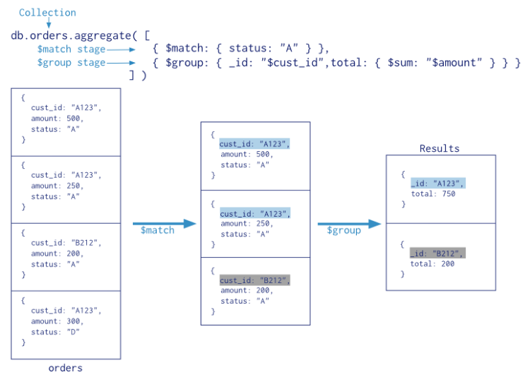

### 7.1 Lanzamiento

- Las tuberías de agregación se lanzan con el comando aggregate a partir de una colección:`db.collection.aggregate([etapa1, ..., etapan])`.


- El comando **aggregate** recibe una lista dedocumentos **etapa1, ..., etapaN** que definen el **orden** y la **configuración** de cada una de las etapas.

### 7.2 Etapas

- Las tuberías de agregación pueden tener cualquier número de etapas.
- El programador configura la secuencia de etapas a aplicar mediante documentos.
- El **resultado** de una tubería de agregación se puede volcar en una **nueva colección**, o ser devuelto como un cursor como si se tratase de una consulta común.
- En las **colecciones intermedias** no es necesario garantizar que el campo **_id** sea único.
- Existen al menos 13 tipos diferentes de etapas que se pueden utilizar, más info en  [Referencias Aggregation Pipelines](#11.4 Aggregation Pipelines).

#### 7.2.1 $project

- La etapa **$project** sirve para **eliminar o añadir campos** a los documentos, es decir, reestructurar documentos.


- La etapa $project se define con la siguiente sintaxis: `{ $project: { <proyección> } }`.


- **\<proyección\>** es una serie de parejas:

  - **\<campo\>: \<1 o true\>** → 'campo' es incluido. Por defecto ningún campo se incluye si no se expresa explícitamente, salvo _id._
  - **\_id: \<0 o false\>** → No incluir el campo _id, que por defecto siempre se incluye.
  - **\<campo\>: \<expresión\>** → Añadir un nuevo campo o restablecer el contenido de un campo existente.

- **Ejemplos**:

  - Quedarse únicamente con el campo **name**:

    ```shell
    db.agg.aggregate([
      {$project : {_id:0, age:1}}
    ])
    ```

    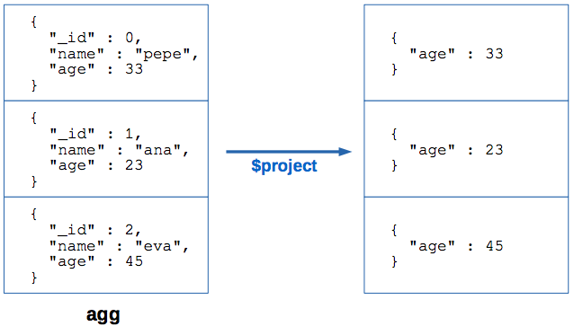

  - Renombrar el campo **age** a **edad** y ocultar **name**:

    ```shell
    db.agg.aggregate([
      {$project : {edad:'$age'}}
    ])
    ```

    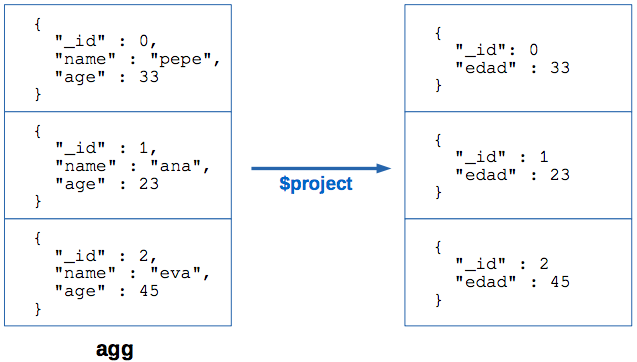

  - **Aumentar en 1 año** el campo de **age** de cada documento:

    ```shell
    db.agg.aggregate([
      {$project : {age:{$add:'$age',1]}, name:1}}
    ])
    ```

    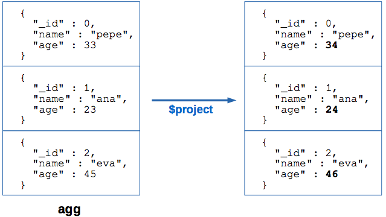

#### 7.2.2 $match

- La etapa **$match filtra** los documentos, dejando pasar únicamente aquellos que cumplen una cierta **propiedad**.

- La sintaxis de la etapa $match es: `{ $match: { <propiedad> } }`.

- **\<propiedad\>** es una condición representada de la misma manera que las usadas en find().

- **Optimizar** con **$match**:

  - La etapa $match **reduce** el número de documentos a aquellos que cumplen la propiedad.
  - Por ello es interesante colocar $match **lo más al principio** de la tubería:
    - Las **etapas siguientes** serán más rápidas pues manejarán **menos documentos**.
    - Al ejecutarse al inicio, es más posible que $match saque provecho de los **índices**.

- **Ejemplos**:

  - Filtrar los documentos cuya **edad** es **23**:

    ```shell
    db.agg.aggregate([
      {$match : {age:23}}
    ])
    ```

    

  - Filtrar los documentos con **edad superior a 28** años:

    ```shell
    db.agg.aggregate([
      {$match : {age:{$gt:28}} }
    ])
    ```

    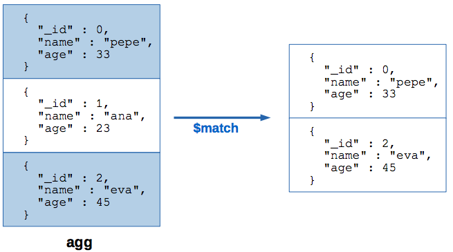

  - Filtrar los documentos que tienen **edad inferior** a **30** años o se llaman **"eva"**:

    ```shell
    db.agg.aggregate([
      {$match: {$or: [{age:{$lt:30}},{name:"eva"}] }}
    ])
    ```

    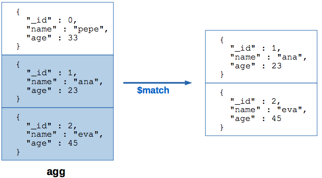

#### 7.2.3 $sort

- **Ordena** los documentos recibidos, de acuerdo al orden pasado como parámetro.

- La sintaxis de la etapa $sort es: `{ $sort: <orden> }`.

- **\<orden\>** es un documento con información de orden representada de la misma manera que la usadas en sort().

- **Ejemplos:**

  - Ordenar los documentos por **edad ascendente**:

    ```shell
    db.agg.aggregate([
      {$sort : {age:1}}
    ])
    ```

    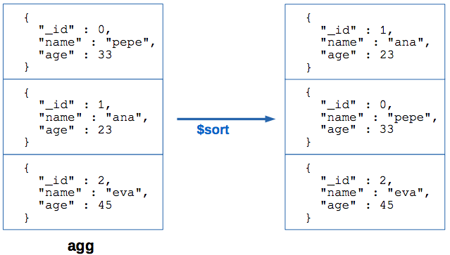

  - Ordear los documentos por **nombre descendente**, y luego por **_id ascendente**:

    ```shell
    db.agg.aggregate([
      {$sort : {name:-1, _id:1}}
    ])
    ```

    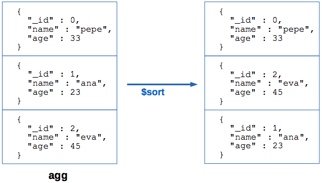

#### 7.2.4 $limit

- La etapa $limit sirve para limitar a un número fijo la cantidad de documentos que pasan a la siguiente etapa.

- La sintaxis de la etapa $limit es: `{ $limit: <entero positivo> }`.

- **\<entero positivo\>** es cualquier número entero mayor que 0.

- **Ejemplo:**

  - Limitar la salida a **2 documentos:**

    ```shell
    db.agg.aggregate([
    	{$limit : 2}
    ])
    ```

    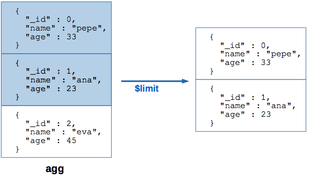

#### 7.2.5 $limit y $sort

- $limit devuelve los **primeros 'n'** documentos de entrada, respetando el orden que éstos tienen.
- Si se encadena una etapa **$sort** y justo después una etapa **$limit**, MongoDB **optimizará** la etapa $sort:
  - Durante la ordenación ($sort) MongoDB únicamente almacenará **'n' resultados** en memoria.

#### 7.2.6 $skip

- La etapa $skip **descarta** los primeros **'n' documentos** de entrada y devuelve el resto.

- La sintaxis de la etapa $limit es: `{ $skip: <entero positivo> }`.

- **\<entero positivo\>** es cualquier número entero mayor o igual que 0.

- **Ejemplos:**

  - **Descartar** el **primer** documento:

    ```shell
    db.agg.aggregate([
      {$skip : 1}
    ])
    ```

    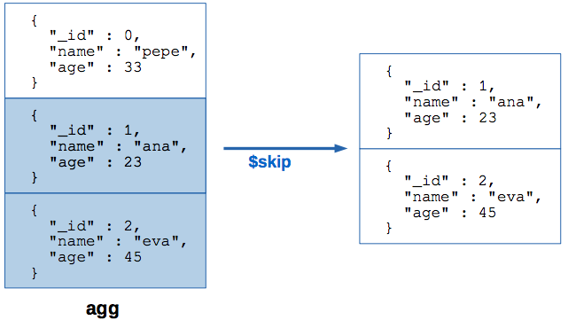

#### 7.2.7 $unwind

- La etapa $unwind **despliega** un campo que contiene una lista, generando un **documento** por **cada valor de la lista**.

- La sintaxis de la etapa $limit es: `{ $unwind: <campo> }`.

- **\<campo\>** es el nombre del campo que queremos usar para desplegar.

- **Ejemplos:**

  - Desplegar por el campo **nums**:

    ```shell
    db.agg.aggregate([
       {$unwind: "$nums"}
    ])
    ```

    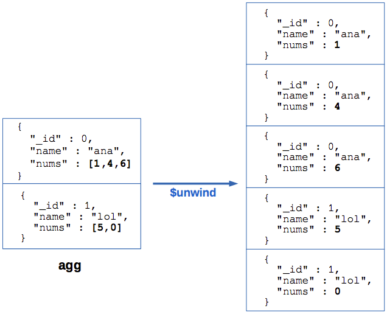

    ​

  - Si en algún documento el **campo** escogido para el desplegado **no contiene una lista**, se tratará como una **lista unitaria**. No lanzará **ningún error**.

    ```shell
    db.agg.aggregate([
      {$unwind: "$name"}
    ])
    ```

    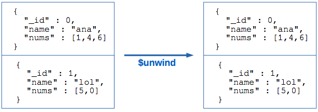

    ​

  - Si en algún documento el **campo** escogido para el desplegado **no existe**, ese documento se **ignorará** pero no se lanzará **ningún error**:

    ```shell
    db.agg.aggregate([
      {$unwind: "$years"}
    ])
    ```

    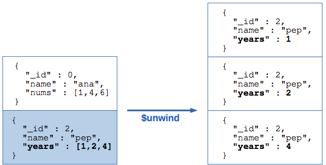

    ​

  - El **campo** escogido para desplegar puede estar **anidado** dentro de otro campo:

    ```shell
    db.agg.aggregate([
      {$unwind: "$likes.nums"}
    ])
    ```

    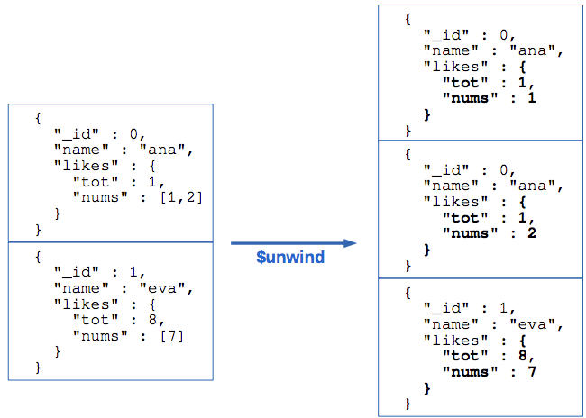

#### 7.2.8 $group

- La etapa $group **agrupa documentos** con el mismo valor en un campo **(clave)** en un solo documento.


- Este documento generado tendrá campos que **combinan** los datos de aquellos que tenían la misma clave:

  - Edad media de los usuario de España.
  - Puntuación máxima en un examen.
  - Lista de todos los usuarios de Francia.

- La etapa $group tiene la sintaxis:

  ```shell
  { $group: { _id: <clave>,
  	<campo1>: { <acumulador1> : <expresion1> }, ... } }
  ```

- **\<clave\>** es el campo o combinación de campos que se utilizará como clave.

- **\<campoN\>** es el nombre del campo que almacenará el valor combinado.

- **\<acumuladorN\>** es el operador acumulador ($sum, $avg, $max, etc.) que se usará para agregar los valores de los documentos.

- **\<expresionN\>** es la expresión que genera los valores que se acumularán por cada documento. Puede ser el nombre de un campo , una constante, una operación aritmética, de listas, etc.

- **Ejemplo:**

  - Obtener la edad máxima de los estudiantes por cada Universidad:

    ```shell
    db.agg.aggregate([
       {$group: {_id: "$edu",
                 max_age: {$max:"$age"} }}
    ])
    ```

    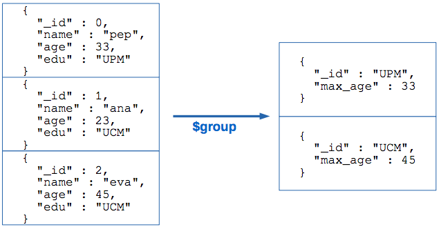

  - Calcular la **edad media** y el **número de alumnos** por **Universidad**:

    ```shell
    db.agg.aggregate([
      $group: {_id: "$edu",
               avg_age: {$avg:"$age"}, count: {$sum:1} }}
    ])
    ```

    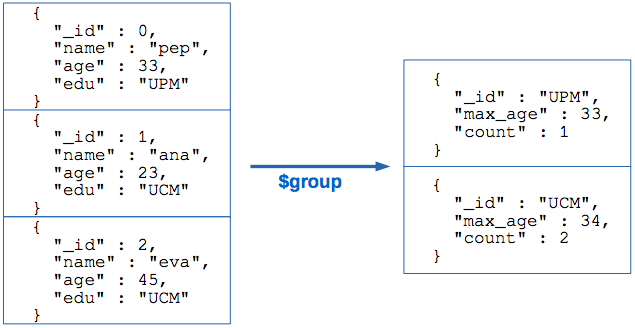

    ​

  - Obtener los nombres de los **alumnos** de cada **Universidad** en un único documento:

    ```shell
    db.agg.aggregate([
         {$group: {_id: "$edu",
                   names:{$push:"$name"} }}
    ])
    ```

    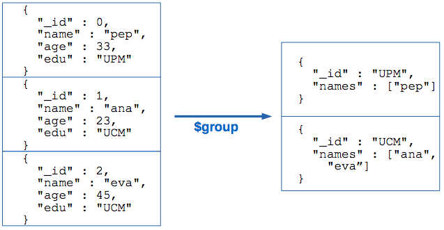

#### 7.2.9 $lookup

- La etapa $lookup realiza una combinación externa izquierda **(left outer join)** de los documentos de entrada con otra colección.

- La combinación se realiza comparando dos campos de los documentos que pueden tener un **nombre diferente**: uno de la colección **local** y otro de la **externa**.

- El documento de la colección se **extiende** con una **lista** conteniendo los documentos de la otra colección que tienen el mismo valor en el campo.

- La sintaxis de la etapa $lookup es:

  ```shell
  { $lookup: {
  	from: <colección externa a combinar>,
  	localField: <nombre del campo de los docs de la colección local a comparar>, 
  	foreignField: <nombre del campo de los docs. De la colección externa a comparar>,
  	as: <nombre del campo generado que almacenará la lista>
  }}
  ```

- El nuevo campo añadido por $lookup contiene una lista con los documentos **completos** que encajan.

- Este nuevo campo puede ser una **lista vacía** si en la colección externa no hay ningún documento que encaje.

- La colección externa debe pertenecer a la **misma base de datos**.

- **Ejemplo:**

  - Combinar usuarios con sus pedidos:

    ```shell
    db.users.aggregate([
      $lookup: { from : "orders",
                 localField : "dni",
                 foreignField  : "user",
                 as : "pedidos"} }
    ])
    ```

    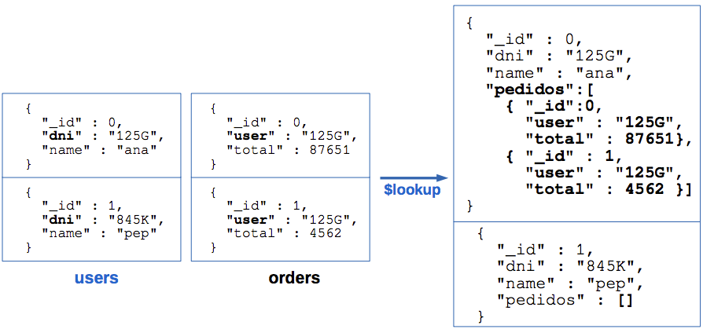

#### 7.2.10 $out

- La etapa $out **almacena** los documentos en una **colección**.

- La colección de salida se **crea** si no existe, y si existe se **reemplaza completamente**.

- La sintaxis de $out es: `{ $out: <colección de salida> }`.

- La etapa $out fallará si existen documentos con el campo **_id** duplicado.

- Si los documentos carecen de _id, éste campo será **generado automáticamente**.

- La etapa $out debe ser la **última de la tubería**.

- **Ejemplo:**

  - Volcar los resultados en la colección **summary:**

    ```shell
    db.users.aggregate([
    	..., // Etapas anteriores
       { $out : “summary”}
    ]}
    ```

### 7.3 Conectar tuberías

- Hasta ahora hemos visto ejemplos de tuberías de una sola etapa, que toman la entrada directamente de una colección.

- La potencia del aggregation pipeline consiste en su **combinar etapas**.

- Para ello solo es necesario definir las etapas enel orden deseado.

- **Ejemplos:**

  - Universidades con 2 o más alumnos:

    ```shell
    db.students.aggregate([
      {$group : {"_id":"$edu", "num":{$sum:1}}},
      {$match : {"num":{$gte:2}}}
    ])
    ```

    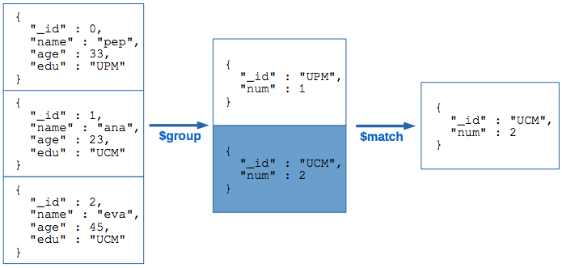

  - Universidad que tiene más alumnos:

    ```shell
    db.students.aggregate([
      {$group : {"_id":"$edu", "num":{$sum:1}}},
      {$sort : {"num" : -1}},
      {$limit : 1},
    ])
    ```

    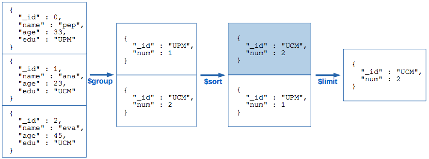

  - Frecuencia de cada número:

    ```shell
    db.students.aggregate([
      {$unwind:"$nums"},
      {$group: {"_id":"$nums", "freq":{"$sum":1}}}
    ])
    ```

    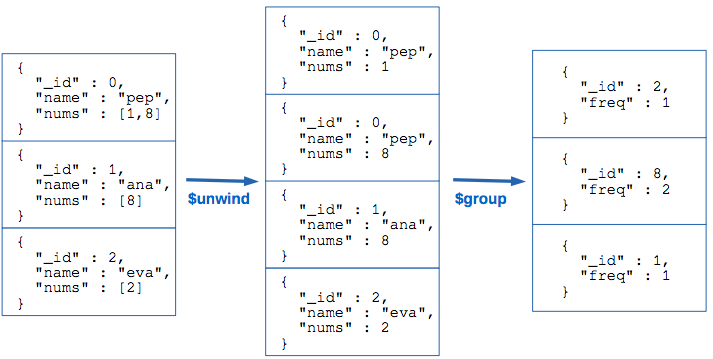

### 7.4 Aggregation pipelines en pymongo

- Los objetos **Collection** de pymongo tienen un método **aggregate** (ver detalles en [Referencias](#11.4 Aggregation Pipelines)).

- El método aggregate() recibe una **lista Python de etapas** representadas como diccionarios.

- La sintaxis de cada etapa es **exactamente igual** a la usada en la **consola** de MongoDB.

  ```python
  from pymongo import MongoClient

  mongoclient = MongoClient()
  db = mongoclient['giw']
  c = db['users']

  c.insert_one({'name' : 'ana', '_id' : 0, 'edad' : 24})
  c.insert_one({'name' : 'eva', '_id' : 1, 'edad' : 28})
  c.insert_one({'name' : 'pep', '_id' : 2, 'edad' : 34})

  r = c.aggregate( [
    {'$match' : {'edad': {'$gt' : 25}} },
    {'$sort' : {'edad' : -1}}
  ])

  for e in r:
      #Procesar e
  ```

  ​

## 11. Referencias

- **Operaciones CRUD** (crear, leer, actualizar y eliminar): https://docs.mongodb.com/manual/crud/
- **Operadores de consulta**: https://docs.mongodb.com/manual/reference/operator/query/

### 11.2 API pymongo:

- https://api.mongodb.com/python/current/api/index.html
- **API pymongo (Collection)**: https://api.mongodb.com/python/current/api/pymongo/collection.html#pymongo.collection.Collection
- **API pymongo (Cursor)**: https://api.mongodb.com/python/current/api/pymongo/cursor.html#pymongo.cursor.Cursor

### 11.3 MongoEngine:

- Tutorial básico sobre MongoEngine: http://docs.mongoengine.org/tutorial.html
- Definición de esquemas: http://docs.mongoengine.org/guide/defining-documents.html
- Manejo de objetos: http://docs.mongoengine.org/guide/document-instances.html
- Consultas con MongoEngine:http://docs.mongoengine.org/guide/querying.html
- QuerySet: http://docs.mongoengine.org/apireference.html#mongoengine.queryset.QuerySet
- Operadores de consulta: http://docs.mongoengine.org/guide/querying.html#query-operators

### 11.4 Aggregation Pipelines

- Pipeline Aggregation Stages: https://docs.mongodb.com/manual/reference/operator/aggregation-pipeline/